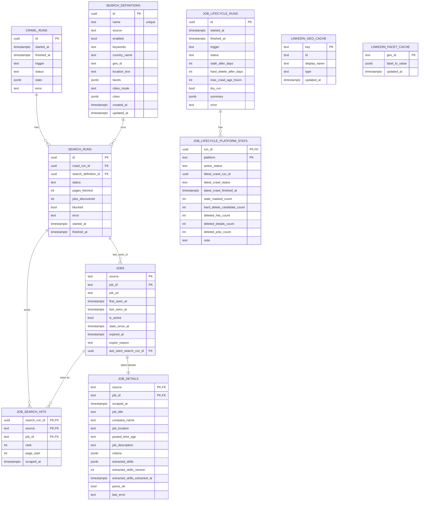

# Database ERD + Data Flows (Supabase Postgres)

Schema: `job_scrape`

This repo uses Supabase Postgres as the system of record. Scrapers write via a direct Postgres
connection (`SUPABASE_DB_URL`) and the UI (later) will read via Supabase client libraries.

## ERD (v1)



Notes:
- LinkedIn uses the shared tables shown above.
- Stepstone uses dedicated tables under the same schema:
  - `stepstone_crawl_runs`
  - `stepstone_search_definitions`
  - `stepstone_search_runs`
  - `stepstone_jobs`
  - `stepstone_job_search_hits`
  - `stepstone_job_details`
- XING uses dedicated tables under the same schema:
  - `xing_crawl_runs`
  - `xing_search_definitions`
  - `xing_search_runs`
  - `xing_jobs`
  - `xing_job_search_hits`
  - `xing_job_details`
- Lifecycle maintenance tables:
  - `job_lifecycle_runs`
  - `job_lifecycle_platform_stats`
- Full Stepstone implementation and operations guide:
  - `/Volumes/T7/job-seeking-web-scrape/docs/STEPSTONE_SCRAPING.md`

Dashboard read model:
- `job_scrape.jobs_dashboard_v`
  - Created by: `scripts/create_dashboard_view.py`
  - Unifies LinkedIn + Stepstone + XING rows with canonical columns:
    - `platform, job_id, job_url, job_title, company_name, job_location, posted_time_ago, job_description, scraped_at, first_seen_at, last_seen_at, parse_ok, last_error, extracted_skills`
  - Adds normalized posted-time fields for dashboard filtering/ordering:
    - `posted_at_utc`
    - `posted_at_source` (`native_xing_posted_at_utc`, `parsed_relative_en`, `parsed_relative_de`, `parsed_keyword`, `missing_input`, `unparsed_format`)
    - `posted_at_parse_ok`
    - `posted_at_parse_detail`
- Parse-gap monitor:
  - `scripts/report_posted_time_parse_gaps.py`
  - Returns any rows where `posted_at_source='unparsed_format'` grouped by `(platform, posted_time_ago)`.

Map geocoding model:
- Cache table: `job_scrape.location_geocode_cache`
  - Created by: `scripts/ensure_geocode_schema.py`
  - Unique cache key: `(provider, location_text_norm, country_scope)`
  - Provider: `geoapify`
  - Status lifecycle: `pending`, `resolved`, `no_match`, `error`, `failed_permanent`
- Geocoding runner: `scripts/geocode_locations_geoapify.py`
  - Seeds distinct non-empty `job_location` from `job_scrape.jobs_dashboard_v`
  - Country scope by platform:
    - LinkedIn + Stepstone: `de`
    - XING: `de,at,ch`
  - Uses Geoapify batch geocoding endpoint with polling + retry backoff
- Map-ready view: `job_scrape.jobs_dashboard_map_v`
  - Created by: `scripts/create_dashboard_map_view.py`
  - Left-joins dashboard rows to geocode cache and exposes:
    - `lat`, `lon`
    - geocode status/quality metadata (`geocode_status`, `geocode_result_type`, `geocode_rank_confidence`, ...)

## Read/Write Paths

### A) Search definition sync (YAML -> DB)
Entry point:
- `scripts/sync_search_definitions.py`

Reads:
- none (network calls to LinkedIn guest endpoints)

Writes:
- `job_scrape.search_definitions` (upsert by `name`)

Purpose:
- Turn human-friendly YAML (country names, filter labels) into normalized search definitions:
  - `geo_id` resolved via typeahead
  - `facets` resolved via parsing LinkedIn’s search HTML facet inputs

Stepstone equivalent:
- Entry point: `scripts/sync_search_definitions_stepstone.py`
- Reads: `configs/stepstone.yaml`
- Writes: `job_scrape.stepstone_search_definitions`
  - `location_text` comes from config locations
  - `facets` stores `radius`, `sort`, `where_type`, `search_origin`

XING equivalent:
- Entry point: `scripts/sync_search_definitions_xing.py`
- Reads: `configs/xing.yaml`
- Writes: `job_scrape.xing_search_definitions`
  - expands one search definition per keyword (or keyword x location)
  - keyword list is normalized/deduped case-insensitively before expansion
  - `location_text` is optional (keywords-only mode uses empty string)
  - `country_name` is stored as empty string (XING has no explicit country filter)
  - `facets` stores `pagination_mode='show_more'` and optional `city_id`
  - XING search URL `id` is not stored/resolved here (site generates it)

### B) Discovery pipeline (pagination -> jobs + hits)
Entry point (manual):
- `scripts/run_discovery.py`

Spiders:
- `job_scrape/spiders/linkedin_discovery_paginated.py`
  - paginates via `https://www.linkedin.com/jobs-guest/jobs/api/seeMoreJobPostings/search?...&start=<offset>`
  - outputs JSONL records:
    - `record_type=page_fetch`
    - `record_type=job_discovered`

Importer:
- `scripts/import_discovery.py`

Reads (DB):
- `job_scrape.search_definitions` (enabled searches)

Writes (DB):
- `job_scrape.crawl_runs`
  - insert: status `running`
  - update: `finished_at`, `status`, `stats`, `error`
- `job_scrape.search_runs`
  - insert (one per enabled search definition)
  - update: `finished_at`, `status`, `pages_fetched`, `jobs_discovered`, `blocked`
- `job_scrape.jobs`
  - upsert by `(source, job_id)`
  - sets/updates: `job_url`, `last_seen_at`, `last_seen_search_run_id`
  - reactivates if seen again: `is_active=true`, clears `stale_since_at/expired_at/expire_reason`
- `job_scrape.job_search_hits`
  - insert (idempotent) per `(search_run_id, source, job_id)` with `rank`, `page_start`, `scraped_at`

### C) Details pipeline (select stale/new -> job_details)
Entry point:
- `scripts/run_details.py` (expects `CRAWL_RUN_ID` env var set by orchestrator)

Selection query (DB):
- Select from `job_scrape.jobs` LEFT JOIN `job_scrape.job_details`
- Condition:
  - `jobs.last_seen_at > now() - interval '<DETAIL_LAST_SEEN_WINDOW_DAYS> days'` (default `60`)
  - no details yet, OR `job_details.scraped_at < now() - interval '<DETAIL_STALENESS_DAYS> days'`
- Limit:
  - `MAX_JOB_DETAILS_PER_RUN`

Spider:
- `job_scrape/spiders/linkedin_job_detail_batch.py`
  - HTTP-first fetch
  - if “critical missing” (job_title null) retry once with Playwright
  - circuit breaker: stop early on consecutive block detections
  - outputs JSONL `record_type=job_detail`

Importer:
- `scripts/import_details.py`

Reads (DB):
- `job_scrape.jobs`
- `job_scrape.job_details` (only for staleness/missing selection)

Writes (DB):
- `job_scrape.job_details`
  - upsert by `(source, job_id)`
  - updates all parsed fields + `scraped_at`, `parse_ok`, `last_error`
  - if the columns exist, also writes:
    - `extracted_skills` (jsonb)
    - `extracted_skills_version`
    - `extracted_skills_extracted_at`

Stepstone equivalents:
- Discovery: `scripts/run_discovery_stepstone.py` + `job_scrape/spiders/stepstone_discovery_paginated.py`
  - Playwright-first requests
  - emits only `main` section jobs using Stepstone `data-resultlist-offers-main-displayed`
- Details: `scripts/run_details_stepstone.py` + `job_scrape/spiders/stepstone_job_detail_batch.py`
  - Playwright-first detail fetch
  - upserts `job_scrape.stepstone_job_details`

XING equivalent:
- Discovery: `scripts/run_discovery_xing.py` + `job_scrape/spiders/xing_discovery_paginated.py`
  - Playwright-first requests
  - paginates in-page by clicking `Show more` / `Mehr anzeigen`
  - upserts `job_scrape.xing_jobs` + `job_scrape.xing_job_search_hits`
  - deduped master output is `xing_jobs` (one row per canonical `job_id`)
  - raw per-search/per-keyword appearances are preserved in `xing_job_search_hits`
  - supports keywords-only queries (no location) and optional location/cityId facets
  - captures list-preview metadata for external ads
- Details: `scripts/run_details_xing.py` + `job_scrape/spiders/xing_job_detail_batch.py`
  - Playwright-first detail fetch for internal XING ads
  - JSON-LD-first extraction (`datePosted` -> exact timestamp)
  - grouped skills extraction runs from `configs/data-engineering-keyword-taxonomy.yaml` when description text exists
  - external ads (`External job ad`) are stored from list-preview fields only
  - external list-only ads may have `extracted_skills = null` by design
  - upserts `job_scrape.xing_job_details`

### D) Lifecycle maintenance (stale marking + safe deletion)
Entry point:
- `scripts/maintain_job_lifecycle.py`

Schema ensure:
- `scripts/ensure_lifecycle_schema.py`

Safety gate per platform:
- Latest crawl run with discovery enabled (`stats.discovery.status != 'skipped'`) must be `status='success'`
- Latest successful crawl must be recent enough:
  - `LIFECYCLE_MAX_CRAWL_AGE_HOURS` (default `36`)

Actions (when platform passes health gate):
- Soft-expire stale rows:
  - `last_seen_at < now() - interval '<LIFECYCLE_STALE_AFTER_DAYS> days'` (default `60`)
  - updates jobs table fields: `is_active=false`, `stale_since_at`, `expired_at`, `expire_reason='not_seen_window'`
- Hard-delete older rows:
  - `last_seen_at < now() - interval '<LIFECYCLE_HARD_DELETE_AFTER_DAYS> days'` (default `120`)
  - delete order: `*_job_search_hits` -> `*_job_details` -> `*_jobs`

Writes:
- `job_scrape.job_lifecycle_runs` (one row per lifecycle run)
- `job_scrape.job_lifecycle_platform_stats` (one row per platform per run)

### E) Orchestrated run (sync -> discovery -> details)
Entry point:
- `scripts/run_crawl.py`

Flow:
1. (optional) `scripts/sync_search_definitions.py` if `SYNC_SEARCH_DEFINITIONS=1`
2. `scripts/run_discovery.py`
3. `scripts/run_details.py`
4. Update `job_scrape.crawl_runs` with combined `stats` and final `status`

Stepstone orchestrator:
- `scripts/run_crawl_stepstone.py`
- Flow:
1. `scripts/create_stepstone_tables.py` (idempotent table ensure; default enabled)
2. (optional) `scripts/sync_search_definitions_stepstone.py` if `SYNC_SEARCH_DEFINITIONS_STEPSTONE=1`
3. `scripts/run_discovery_stepstone.py`
4. `scripts/run_details_stepstone.py`
5. Update `job_scrape.stepstone_crawl_runs` with combined `stats` and final `status`

XING orchestrator:
- `scripts/run_crawl_xing.py`
- Flow:
1. `scripts/create_xing_tables.py` (idempotent table ensure; default enabled)
2. (optional) `scripts/sync_search_definitions_xing.py` if `SYNC_SEARCH_DEFINITIONS_XING=1`
3. `scripts/run_discovery_xing.py`
4. `scripts/run_details_xing.py` (default enabled; disable with `RUN_DETAILS=0`)
5. Update `job_scrape.xing_crawl_runs` with combined `stats` and final `status`
6. Optional one-time migration helper: `scripts/backfill_xing_from_shared.py`
7. Reporting (`REPORT_SOURCE=xing`) includes raw vs deduped counters:
   - `hits_total`, `unique_jobs_total`, `duplicates_removed_total`

## Concurrency and Safety (where enforced)

Crawler-level throttling (Scrapy settings):
- `job_scrape/settings.py`

Run-time budgets (env-driven):
- `job_scrape/runtime.py`

Block detection + stop early:
- `job_scrape/spiders/linkedin_discovery_paginated.py`
- `job_scrape/spiders/linkedin_job_detail_batch.py`

## Lifecycle Log Queries

Latest lifecycle run:

```sql
select id, started_at, finished_at, trigger, status, dry_run, summary
from job_scrape.job_lifecycle_runs
order by started_at desc
limit 1;
```

Per-platform stats for latest lifecycle run:

```sql
select s.platform,
       s.action_status,
       s.latest_crawl_status,
       s.latest_crawl_finished_at,
       s.stale_marked_count,
       s.hard_delete_candidate_count,
       s.deleted_hits_count,
       s.deleted_details_count,
       s.deleted_jobs_count,
       s.note
from job_scrape.job_lifecycle_platform_stats s
where s.run_id = (
  select id
  from job_scrape.job_lifecycle_runs
  order by started_at desc
  limit 1
)
order by s.platform;
```
