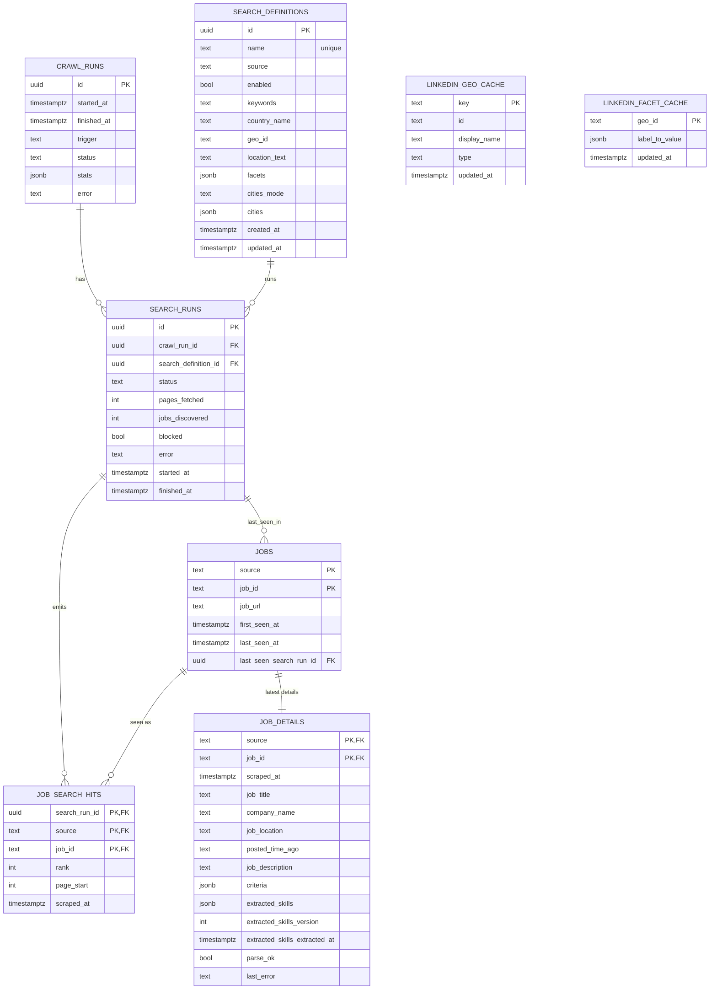

# Database ERD + Data Flows (Supabase Postgres)

Schema: `job_scrape`

This repo uses Supabase Postgres as the system of record. Scrapers write via a direct Postgres
connection (`SUPABASE_DB_URL`) and the UI (later) will read via Supabase client libraries.

## ERD (v1)

Notes:
- LinkedIn and XING use shared tables shown above.
- Stepstone now uses dedicated tables under the same schema:
  - `stepstone_crawl_runs`
  - `stepstone_search_definitions`
  - `stepstone_search_runs`
  - `stepstone_jobs`
  - `stepstone_job_search_hits`
  - `stepstone_job_details`
- Full Stepstone implementation and operations guide:
  - `/Volumes/T7/job-seeking-web-scrape/docs/STEPSTONE_SCRAPING.md`

## Read/Write Paths

### A) Search definition sync (YAML -> DB)
Entry point:
- `scripts/sync_search_definitions.py`

Reads:
- none (network calls to LinkedIn guest endpoints)

Writes:
- `job_scrape.search_definitions` (upsert by `name`)

Purpose:
- Turn human-friendly YAML (country names, filter labels) into normalized search definitions:
  - `geo_id` resolved via typeahead
  - `facets` resolved via parsing LinkedIn’s search HTML facet inputs

Stepstone equivalent:
- Entry point: `scripts/sync_search_definitions_stepstone.py`
- Reads: `configs/stepstone.yaml`
- Writes: `job_scrape.stepstone_search_definitions`
  - `location_text` comes from config locations
  - `facets` stores `radius`, `sort`, `where_type`, `search_origin`

XING equivalent:
- Entry point: `scripts/sync_search_definitions_xing.py`
- Reads: `configs/xing.yaml`
- Writes: `job_scrape.search_definitions` rows with `source='xing'`
  - `location_text` is optional (keywords-only mode uses empty string because current shared table has `NOT NULL` for `location_text`)
  - `country_name` is stored as empty string for XING compatibility with shared table constraints
  - `facets` stores `pagination_mode='show_more'` and optional `city_id`
  - XING search URL `id` is not stored/resolved here (site generates it)

### B) Discovery pipeline (pagination -> jobs + hits)
Entry point (manual):
- `scripts/run_discovery.py`

Spiders:
- `job_scrape/spiders/linkedin_discovery_paginated.py`
  - paginates via `https://www.linkedin.com/jobs-guest/jobs/api/seeMoreJobPostings/search?...&start=<offset>`
  - outputs JSONL records:
    - `record_type=page_fetch`
    - `record_type=job_discovered`

Importer:
- `scripts/import_discovery.py`

Reads (DB):
- `job_scrape.search_definitions` (enabled searches)

Writes (DB):
- `job_scrape.crawl_runs`
  - insert: status `running`
  - update: `finished_at`, `status`, `stats`, `error`
- `job_scrape.search_runs`
  - insert (one per enabled search definition)
  - update: `finished_at`, `status`, `pages_fetched`, `jobs_discovered`, `blocked`
- `job_scrape.jobs`
  - upsert by `(source, job_id)`
  - sets/updates: `job_url`, `last_seen_at`, `last_seen_search_run_id`
- `job_scrape.job_search_hits`
  - insert (idempotent) per `(search_run_id, source, job_id)` with `rank`, `page_start`, `scraped_at`

### C) Details pipeline (select stale/new -> job_details)
Entry point:
- `scripts/run_details.py` (expects `CRAWL_RUN_ID` env var set by orchestrator)

Selection query (DB):
- Select from `job_scrape.jobs` LEFT JOIN `job_scrape.job_details`
- Condition:
  - no details yet, OR `job_details.scraped_at < now() - interval '<DETAIL_STALENESS_DAYS> days'`
- Limit:
  - `MAX_JOB_DETAILS_PER_RUN`

Spider:
- `job_scrape/spiders/linkedin_job_detail_batch.py`
  - HTTP-first fetch
  - if “critical missing” (job_title null) retry once with Playwright
  - circuit breaker: stop early on consecutive block detections
  - outputs JSONL `record_type=job_detail`

Importer:
- `scripts/import_details.py`

Reads (DB):
- `job_scrape.jobs`
- `job_scrape.job_details` (only for staleness/missing selection)

Writes (DB):
- `job_scrape.job_details`
  - upsert by `(source, job_id)`
  - updates all parsed fields + `scraped_at`, `parse_ok`, `last_error`
  - if the columns exist, also writes:
    - `extracted_skills` (jsonb)
    - `extracted_skills_version`
    - `extracted_skills_extracted_at`

Stepstone equivalents:
- Discovery: `scripts/run_discovery_stepstone.py` + `job_scrape/spiders/stepstone_discovery_paginated.py`
  - Playwright-first requests
  - emits only `main` section jobs using Stepstone `data-resultlist-offers-main-displayed`
- Details: `scripts/run_details_stepstone.py` + `job_scrape/spiders/stepstone_job_detail_batch.py`
  - Playwright-first detail fetch
  - upserts `job_scrape.stepstone_job_details`

XING equivalent:
- Discovery: `scripts/run_discovery_xing.py` + `job_scrape/spiders/xing_discovery_paginated.py`
  - Playwright-first requests
  - paginates in-page by clicking `Show more` / `Mehr anzeigen`
  - upserts shared `job_scrape.jobs` + `job_scrape.job_search_hits` with `source='xing'`
  - supports keywords-only queries (no location) and optional location/cityId facets

### D) Orchestrated run (sync -> discovery -> details)
Entry point:
- `scripts/run_crawl.py`

Flow:
1. (optional) `scripts/sync_search_definitions.py` if `SYNC_SEARCH_DEFINITIONS=1`
2. `scripts/run_discovery.py`
3. `scripts/run_details.py`
4. Update `job_scrape.crawl_runs` with combined `stats` and final `status`

Stepstone orchestrator:
- `scripts/run_crawl_stepstone.py`
- Flow:
1. `scripts/create_stepstone_tables.py` (idempotent table ensure; default enabled)
2. (optional) `scripts/sync_search_definitions_stepstone.py` if `SYNC_SEARCH_DEFINITIONS_STEPSTONE=1`
3. `scripts/run_discovery_stepstone.py`
4. `scripts/run_details_stepstone.py`
5. Update `job_scrape.stepstone_crawl_runs` with combined `stats` and final `status`

XING orchestrator:
- `scripts/run_crawl_xing.py`
- Flow:
1. (optional) `scripts/sync_search_definitions_xing.py` if `SYNC_SEARCH_DEFINITIONS_XING=1`
2. `scripts/run_discovery_xing.py`
3. Update `job_scrape.crawl_runs` with discovery `stats` and final `status`

## Concurrency and Safety (where enforced)

Crawler-level throttling (Scrapy settings):
- `job_scrape/settings.py`

Run-time budgets (env-driven):
- `job_scrape/runtime.py`

Block detection + stop early:
- `job_scrape/spiders/linkedin_discovery_paginated.py`
- `job_scrape/spiders/linkedin_job_detail_batch.py`
